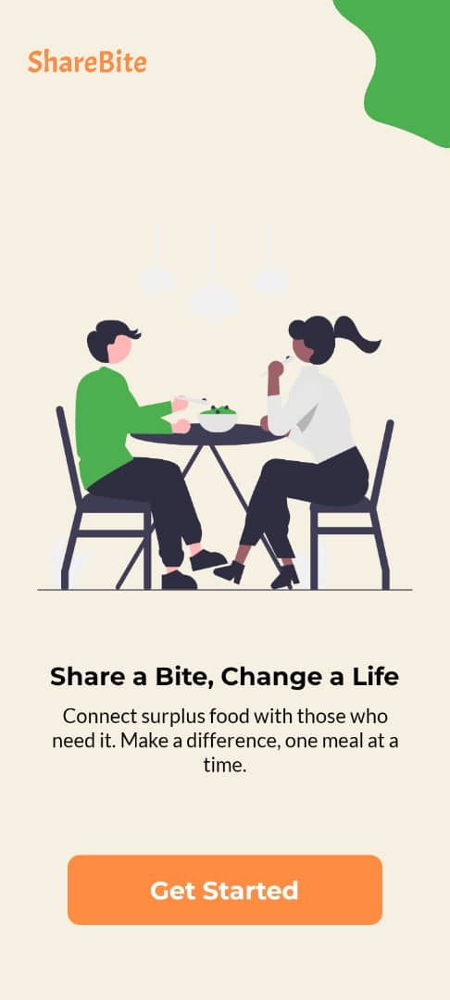
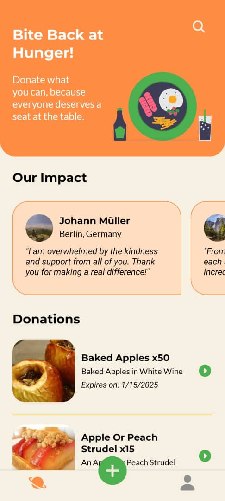
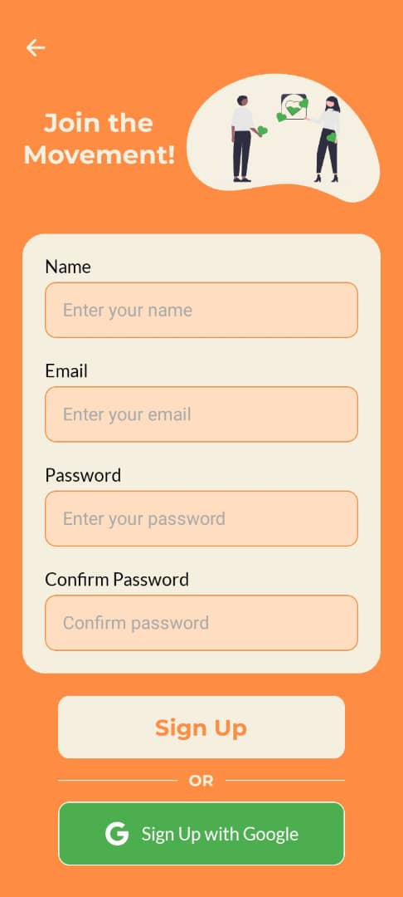
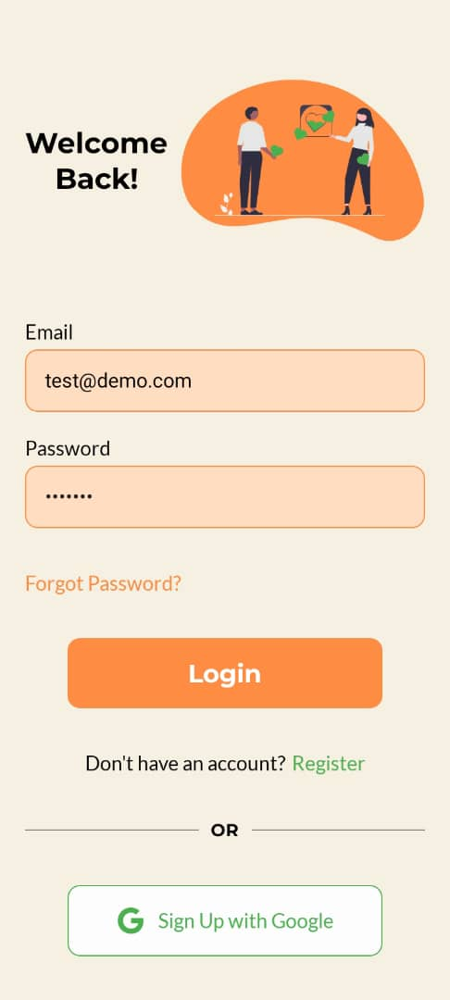
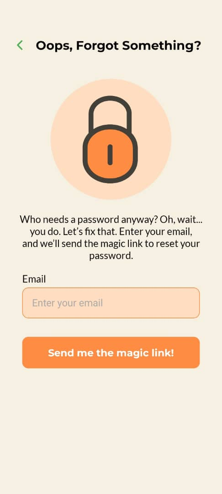
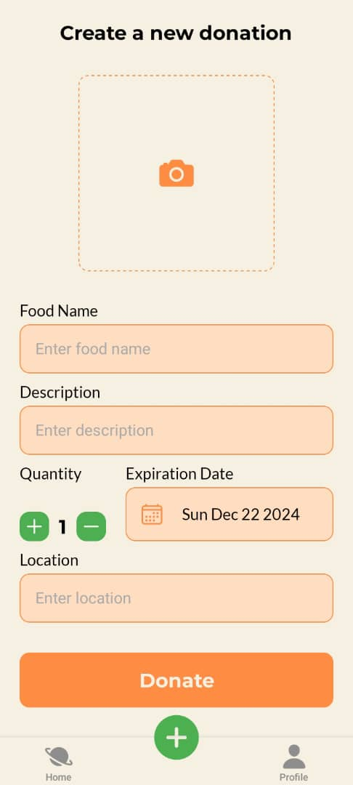
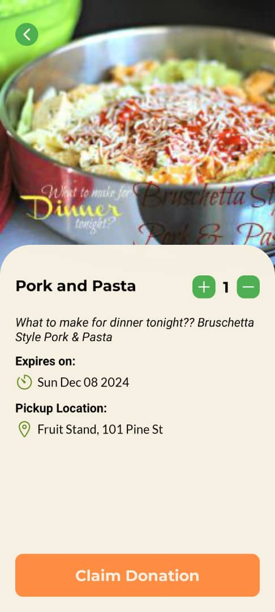
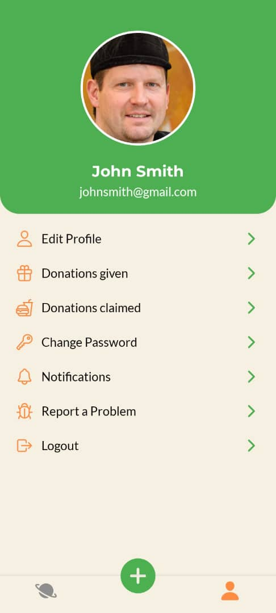

# ShareBite

A simple food donation app that allows users to donate and claim food based on availability in their local area.

## Features

- **User Authentication:** Donors and recipients can create accounts and log in.
- **Donation Listings:** Donors can post food items, and recipients can view and claim donations.
- **Simple Notifications:** Users are notified when new donations are posted.

## Tech Stack

- **Frontend:** React Native with Expo
- **Database:** Firebase Firestore
- **Authentication:** Firebase Authentication

## Setup

1. **Clone the repo:**

   ```bash
   git clone https://github.com/luwanise/sharebite.git
   cd sharebite
   ```

2. **Install dependencies:**

   ```bash
   npm install
   ```

3. **Run the app:**

   ```bash
   expo start
   ```

   This will open the app in the Expo Go app or in a web browser for testing.

## Screenshots

Here are some screenshots of the app:

<div style="display: flex; flex-wrap: wrap;">
  
  
  
  
  
  
  
  
</div>

## Contributing

Feel free to fork the repository and submit pull requests for any improvements or fixes.

## License

This project is licensed under the MIT License.